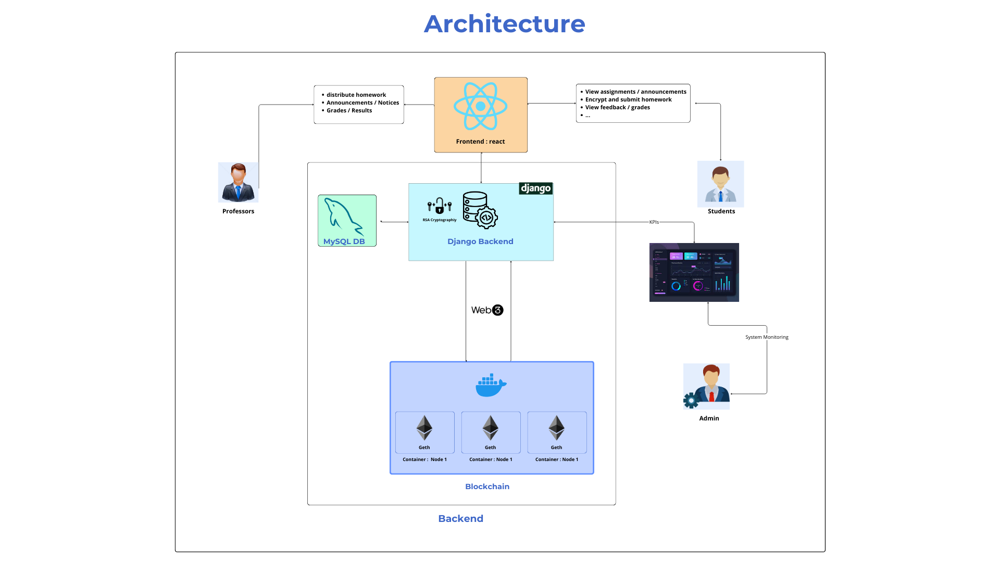

# Blockchain-Based Assignment Management System

A decentralized educational platform leveraging blockchain technology to manage academic assignments with enhanced security, transparency, and immutability.

## Project Overview

This system uses a private Ethereum blockchain with Proof of Authority consensus to provide a secure, transparent, and tamper-proof platform for assignment submission, grading, and result publication in educational institutions.

### Architecture



### Key Features

- Decentralized assignment management using blockchain technology
- RSA encryption for student submission confidentiality
- Immutable grade records on blockchain
- Private Ethereum network with 3-node architecture
- Smart contract-based access control and business logic
- Real-time blockchain transaction tracking
- Role-based authentication (Students, Professors, Admins)

## Architecture

## System Components

### Backend
[](https://www.python.org/)
[](https://www.djangoproject.com/)
[](https://www.django-rest-framework.org/)
[](https://www.sqlite.org/)

### Frontend
[](https://reactjs.org/)
[](https://vitejs.dev/)
[](https://mui.com/)
[](https://developer.mozilla.org/en-US/docs/Web/JavaScript)

### Blockchain
[](https://ethereum.org/)
[](https://soliditylang.org/)
[](https://web3js.readthedocs.io/)
[](https://www.docker.com/)

### Security & Cryptography
[](https://en.wikipedia.org/wiki/RSA_(cryptosystem))
[](https://en.wikipedia.org/wiki/Advanced_Encryption_Standard)
[](https://en.wikipedia.org/wiki/SHA-2)

## Technology Stack

### Blockchain Layer
- Geth v1.10.26 (Go-Ethereum)
- Solidity 0.8.17
- Web3.py
- Docker & Docker Compose

### Backend
- Python 3.11+
- Django 4.x
- Django REST Framework
- PyCryptodome (RSA encryption)
- eth-account
- solcx

### Frontend
- React 18
- Vite
- Material-UI (MUI)
- Axios
- React Router

## Project Structure

```
Blockchain-Based Assignment Management System/
│
├── Blockeduc/
│   ├── educhain/                    # Django Backend
│   │   ├── manage.py
│   │   ├── educhain/                # Django project settings
│   │   ├── blocknet/                # Main Django app
│   │   │   ├── models.py            # Database models
│   │   │   ├── views.py             # API endpoints
│   │   │   ├── serializers.py       # DRF serializers
│   │   │   └── urls.py              # URL routing
│   │   └── blockchain/              # Blockchain integration
│   │       ├── interact.py          # Web3 interaction functions
│   │       ├── utils.py             # Cryptographic utilities
│   │       └── compiled/            # Compiled smart contracts
│   │
│   ├── frontend/                    # React Frontend
│   │   ├── src/
│   │   │   ├── App.jsx              # Main app component
│   │   │   ├── auth/                # Authentication pages
│   │   │   ├── dashboards/          # Role-based dashboards
│   │   │   │   ├── student/
│   │   │   │   ├── professor/
│   │   │   │   └── admin/
│   │   │   ├── components/          # Reusable components
│   │   │   └── pages/               # Static pages
│   │   ├── package.json
│   │   └── vite.config.js
│   │
│   ├── geth/                        # Blockchain Infrastructure
│   │   ├── docker/                  # Docker configuration
│   │   │   ├── docker-compose.yml   # Multi-node orchestration
│   │   │   ├── Dockerfile           # Node image definition
│   │   │   ├── genesis.json         # Blockchain genesis block
│   │   │   ├── init.sh              # Node initialization script
│   │   │   └── connect_nodes.bat    # Peer connection script
│   │   ├── contracts/               # Solidity smart contracts
│   │   │   └── AssignmentSystem.sol
│   │   └── python/                  # Blockchain Python scripts
│   │       ├── deploy_contract.py   # Contract deployment
│   │       ├── interact.py          # Blockchain interactions
│   │       └── Integration_tests.py # Network tests
│   │
│   ├── requirements.txt             # Python dependencies
│   └── start_project.bat            # Quick start script
│
└── Report & Documentation/
    ├── Report.pdf                   # Project documentation
    ├── Presentation.pdf             # Project presentation
    └── Global_Architecture.png      # Architecture diagram
```

## Prerequisites

Before starting, ensure you have:

- Docker Desktop (Windows/Mac) or Docker Engine (Linux)
- Python 3.8 or higher
- Node.js v24.11.1 and npm
- Git

## Installation & Setup

### Step 1: Clone the Repository

```bash
git clone <repository-url>
cd "Blockchain-Based Assignment Management System"
```

### Step 2: Setup Blockchain Network

Navigate to Docker directory and build images:

```bash
cd Blockeduc/geth/docker
docker compose build
```

### Step 3: Setup Django Backend

Navigate to Django directory:

```bash
cd ../../educhain
```

Create and activate virtual environment:

```bash
# Windows
python -m venv venv
venv\Scripts\activate

# Linux/Mac
python3 -m venv venv
source venv/bin/activate
```

Install dependencies:

```bash
pip install -r ../requirements.txt
```

Run migrations:

```bash
python manage.py makemigrations
python manage.py migrate
```

Create superuser:

```bash
python manage.py createsuperuser
```

Create initial roles (in Django shell):

```bash
python manage.py shell
```

```python
from blocknet.models import Role
Role.objects.create(rolename='student')
Role.objects.create(rolename='professor')
Role.objects.create(rolename='admin')
exit()
```

### Step 4: Setup React Frontend

Navigate to frontend directory:

```bash
cd ../frontend
```

Install dependencies:

```bash
npm install
```

## Running the Application

### Option 1: Using Quick Start Script (Recommended)

From the Blockeduc directory:

```bash
# Windows
start_project.bat

# Linux/Mac
bash start_project.sh
```

This automatically starts:
1. Blockchain network (3 nodes)
2. Django backend server
3. React frontend server

### Option 2: Manual Start

**Terminal 1 - Start Blockchain:**
```bash
cd Blockeduc/geth/docker
docker compose up -d
```

**Terminal 2 - Start Django Backend:**
```bash
cd Blockeduc/educhain
venv\Scripts\activate  # Windows
source venv/bin/activate  # Linux/Mac
python manage.py runserver 8000
```

**Terminal 3 - Start React Frontend:**
```bash
cd Blockeduc/frontend
npm run dev
```

## Accessing the Application

After starting the project:

- **Frontend Application**: http://localhost:3000
- **Django Admin Panel**: http://localhost:8000/admin
- **Backend API**: http://localhost:8000/api
- **Blockchain Node 1**: http://localhost:8545
- **Blockchain Node 2**: http://localhost:8555
- **Blockchain Node 3**: http://localhost:8565

## Default Test Accounts

Create test users through Django admin panel or use the following structure:

**Professor Account**:
- Email: professor@ensa.ma
- Password: (set during creation)
- Role: professor

**Student Account**:
- Email: student@ensa.ma
- Password: (set during creation)
- Role: student

## System Features

### For Professors

1. **Assignment Management**
   - Create assignments with RSA encryption keys
   - Set deadlines and descriptions
   - Publish assignments to blockchain

2. **Submission Review**
   - View encrypted student submissions
   - Decrypt submissions using private keys
   - Grade assignments

3. **Grade Publication**
   - Publish grades to blockchain
   - Immutable grade records
   - Transparent grading process

4. **Announcements**
   - Create course announcements
   - Broadcast information to students

### For Students

1. **Assignment Viewing**
   - Browse available assignments
   - View deadlines and requirements
   - Access public encryption keys

2. **Submission Process**
   - Encrypt submissions with professor's public key
   - Submit to blockchain with timestamp proof
   - Track submission status

3. **Grade Access**
   - View published grades
   - Verify grade authenticity on blockchain
   - Access feedback from professors

4. **Blockchain Verification**
   - View transaction history
   - Verify submission timestamps
   - Confirm grade immutability

## Security Features

### Data Protection
- RSA 2048-bit encryption for submissions
- AES-256 encryption for private key storage
- PBKDF2 password hashing with SHA-256

### Blockchain Security
- Proof of Authority consensus preventing Sybil attacks
- Private network isolation from public Ethereum
- Smart contract access control modifiers
- Cryptographic transaction signatures

### Privacy Compliance
- GDPR-compliant data architecture
- Pseudonymous blockchain addresses
- Encrypted personal information
- Role-based access control

## Testing

### Blockchain Network Health Check

```bash
# Check if containers are running
docker ps

# Check block production
curl -X POST http://localhost:8545 \
  -H "Content-Type: application/json" \
  -d '{"jsonrpc":"2.0","method":"eth_blockNumber","params":[],"id":1}'
```

### Run Integration Tests

```bash
cd Blockeduc/geth/python
python Integration_tests.py
```

## Troubleshooting

### Docker Containers Won't Start

```bash
# Stop all containers
docker compose down

# Remove volumes
docker volume prune

# Rebuild and start
docker compose up -d --build
```

### Django Can't Connect to Blockchain

1. Verify blockchain nodes are running: `docker ps`
2. Check node accessibility: `curl http://localhost:8545`
3. Review Django logs for connection errors

### Frontend Can't Reach Backend

1. Verify Django is running on port 8000
2. Check CORS settings in Django settings.py
3. Ensure React .env file has correct API URL

## Project Team

**Academic Year**: 2025-2026

**Institution**: National School of Applied Sciences (ENSA), Abdelmalek Essaâdi University

**Major**: Data Science, Big Data & Artificial Intelligence

**Module**: Blockchain Fundamentals

**Contributors**:
- Anouar bouzhar - Frontend Development, Requirements Analysis, System Modeling
- Hamza Kholti - Blockchain Implementation, Security, Testing

## Documentation

Complete project documentation available in:
- `Report & Documentation/Report.pdf` - Full technical report
- `Report & Documentation/Presentation.pdf` - Project presentation slides

## License

This project is developed for educational purposes as part of the Blockchain Fundamentals course at ENSA.